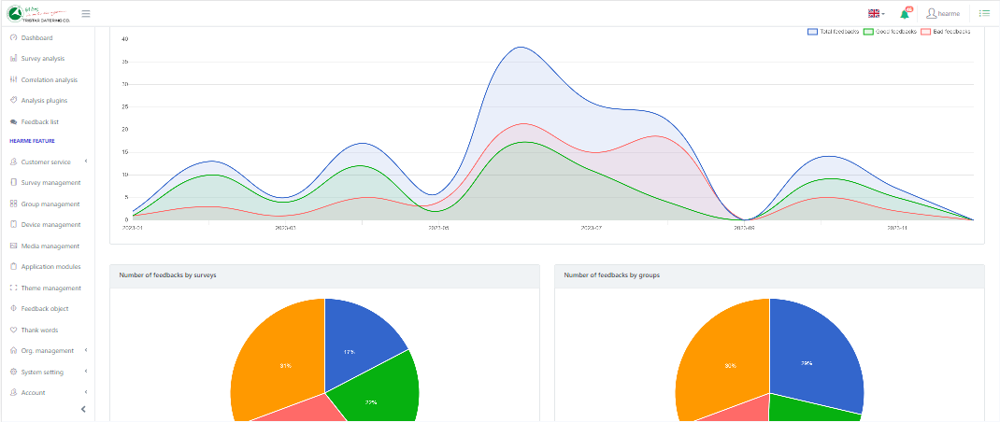
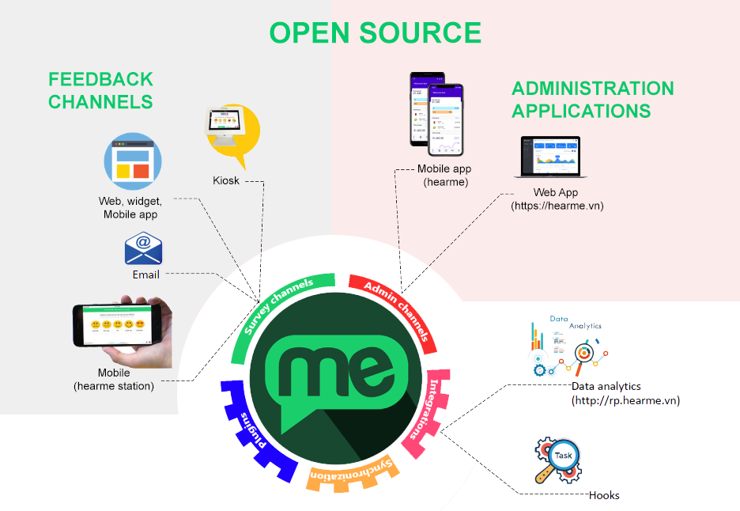

# mobile Zeus
[](https://hearme.vn)

## Description

The **mobile Zeus** module  is your open-source mobile companion for efficiently managing your entire customer experience system. It is an integral part of the [**hearme**](https://hearme.vn) CXM platform, it offers a robust suite of tools designed for collecting and analyzing customer feedback. Built as a hybrid app, it is adaptable to both Android and iOS platforms, ensuring flexibility for your mobile CX management needs.


The **mobile Zeus** shares the same powerful features as its counterpart, [**hearme Zeus**](https://github.com/hearme-vn/hearme-Zeus), enabling CX managers to handle the entire CX system seamlessly from any location and at any time. The repository allow the ability to customize the UI, branding, and application logic to meet specific requirements.

**mobile Zeus** integrates effortlessly with other open-source modules like [**hearme Zeus**](https://github.com/hearme-vn/hearme-Zeus), [hearme_station](https://github.com/hearme-vn/hearme_station), [cx_mobile](https://github.com/hearme-vn/cx_mobile) and [cx_desktop](https://github.com/hearme-vn/cx_desktop). Leveraging services from the **hearme** platform, hosted on the cloud, this integration provides a comprehensive set of tools for configuring your CX system, monitoring, processing feedback, and managing all reporting and analysis data.

With these hearme open-source modules, you can swiftly assemble a complete CXM solution in just a few minutes. Experience the unparalleled flexibility and speed of customization. Join us in distributing innovative solutions to your local market with [hearme](https://hearme.vn).

## hearme architechture



## Demonstration:
- Manage CX system with your mobile Zeus: https://www.youtube.com/watch?v=e7KJPQUzvDc
- Online feedback channels:https://www.youtube.com/watch?v=ThOjFk_Ztv8&list=PLFoi8tG0KXO-mViolS5_1orwIA4GZwYid
- You can configure questions, image, and trademark as you want: https://www.youtube.com/watch?v=uzsVHHXlpNY

## Help for developing application:

1. **Full Programming APIs:** [Hearme for Developers APIs version 2.0.1](https://hearme.vn/help/statics/hearme_dev_APIs_v2.0.1.pdf)
2. **Integration for Online feedback Channel:** [Hearme for Online Channel 2.0.1](https://hearme.vn/help/statics/hearme_dev_APIs_ONLINE_v2.0.1.pdf)
3. **Integration for feedback Kiosk:** [Hearme for Kiosk Channel 2.0.1](https://hearme.vn/help/statics/hearme_dev_APIs_SYN_v2.0.1.pdf)
4. **Integration with Zapier:** [Hearme - Zapier Integration](https://hearme.vn/help/statics/hearme-zapier-documentation_202208.pdf)
5. **Help:** [Other integration](https://hearme.vn/help/en/integration/)


# Getting started to collect feedbacks with hearme platform

1. Run this web application
2. Register a **hearme** account at this app
3. Once you have registered, you can configure your account as steps guided in the onboarding page. Please look for detail information in [help page](https://hearme.vn/help/en/implementation/)
4. You can integrate your system with other administration system. Please refer information at: [Integration](https://hearme.vn/help/en/integration/)


# hearme versions and roadmap

## Version 4.x - Upcoming with AI
- CX Expert Assistant powered by AI for CX practitioners
- Employee Assistant
- Customer Assistant integrated into feedback channels

## Version 3.x
- Improve for mobile
- Fix bugs in survey editor: information survey
- Improve NPS report charts, CSAT chart colors
- Dropdown menu to adap to mobile screen
- Feedback plugin
- Improve for mobile
- Improve report and fix bug
- Page for configuring feedback plugins: do not use labels for plugins


# Running application

## Platforms

Main dependencies for this version:

0. Node: 16.17.0
1. Angular 11.2 (Highest version is 14.0)
2. Core UI: 

- Core 
- Sidebar and menu
- Core UI Icons 
- CoreUI tooltip for chart


3. Chart library

- Chartjs – as base library for charts base on Javascript and html - https://www.chartjs.org/ 
- Ng2-chart: wrapper for chartjs in Angular: https://valor-software.com/ng2-charts/ 
- Plugin for chartjs, making label options: https://github.com/emn178/chartjs-plugin-labels


4. Angular QR Code Generator: https://www.npmjs.com/package/angularx-qrcode
5. ngx-translate: https://github.com/ngx-translate
6. ngx-infinite-scroll: https://www.npmjs.com/package/ngx-infinite-scroll 

## Installation
Install the Angular CLI globally using a terminal/console window.

```bash
npm install -g @angular/cli
```

``` bash
$ git clone https://github.com/hearme-vn/mobile-Zeus.git
$ cd hearme-Zeus
# install app's dependencies
$ npm install
```

## Usage
``` bash
# serve with hot reload at localhost:4200.
$ ng serve --open

# For running in specific port:
$ ng serve --open --port port

# build for dev environment with minification
$ ng build

# build for testing system
$ ng build --configuration=staging 

# build for production - use configuration in: environment.prod.ts
$ ng build --prod

#For prevent error on low heap size, run following build command:
node --max_old_space_size=1024 ./node_modules/@angular/cli/bin/ng build --prod
```

For building mobile app

```bash
# Add Capacitor
npm install @capacitor/core
npm install @capacitor/cli --save-dev

# Setup the Capacitor config
npx cap init
# Adding Native iOS & Android
npm install @capacitor/ios @capacitor/android
npx cap add ios
npx cap add android

# Build the Angular app
ng build --prod

# Sync the build folder to native projects
npx cap sync
# Open Android Studio or Xcode
npx cap open ios
npx cap open android
```

To modify configuration for building production, open file: angular.json then change values in 
```
"configurations": {
    "production": {
    }
}
```

## Setting for Android:

- Configure fiel: AndroidManifest.xml, update permissions:

```
    <!-- Permissions -->
    <uses-permission android:name="android.permission.POST_NOTIFICATIONS" />
    <uses-permission android:name="android.permission.INTERNET" />
    <uses-permission android:name="android.permission.CAMERA" />
    <uses-permission android:name="android.permission.READ_EXTERNAL_STORAGE" />
    <uses-permission android:name="android.permission.WRITE_EXTERNAL_STORAGE" />
```

- Configure bundle id and build version, number in: app/build.gradle

```
    defaultConfig {
        applicationId "com.labsofthings.hearme"
        minSdkVersion rootProject.ext.minSdkVersion
        targetSdkVersion rootProject.ext.targetSdkVersion
        versionCode 3520
        versionName "3.5.2"
        testInstrumentationRunner "androidx.test.runner.AndroidJUnitRunner"
```

- Configure flash image: copy flash_icon.png in drawable folder; add configure in values-v31/styles.xml:

```
<?xml version="1.0" encoding="utf-8"?>
<resources>

  <style name="AppTheme.NoActionBarLaunch" parent="Theme.SplashScreen">
    <!--    <item name="android:background">@drawable/splash</item>-->
    <item name="android:windowSplashScreenBackground">@color/ic_launcher_background</item>

    <!-- Use windowSplashScreenAnimatedIcon to add either a drawable or an animated drawable. One of these is required. -->
    <item name="windowSplashScreenAnimatedIcon">@drawable/splash_icon</item>
    <!-- Required for animated icons -->
    <item name="windowSplashScreenAnimationDuration">200</item>

    <!-- Set the theme of the Activity that directly follows your splash screen. -->
    <item name="postSplashScreenTheme">@style/AppTheme</item>
  </style>
</resources>
```

- Add file google-services.json (download from firebase) to folder: app/src

## Setting for iOS

### Limiting features
To be inline with Apple publishing guideline, following features must be removed:

- Regiter buttons in all pages
- Footer (with external links)


### Configure steps
- Add file: GoogleService-Info.plist (download from firebase) to folder App/App
- Add key - string to Info.plist: 


```
<?xml version="1.0" encoding="UTF-8"?>
<!DOCTYPE plist PUBLIC "-//Apple//DTD PLIST 1.0//EN" "http://www.apple.com/DTDs/PropertyList-1.0.dtd">
<plist version="1.0">
<key>NSCameraUsageDescription</key>
<string>hearme would like to use camera to scan QR code in order to login into app with QR code</string>
</plist>
```

- In General -> Signing and Capabalities, add Notification and Background modes(then choose Remote notifications)
- In General, Status bar, choose: "Requires full screen"
- Change app bundle is: com.labsofthings.hearme.vn
- Update app version and build number

# Support information

Whenever you have a support request, you can reach out to Hearme using the following methods:

1. **Help document:** [https://hearme.vn/help/en/](https://hearme.vn/help/en/)
2. **Facebook:** [https://fb.com/hearme.vn](https://fb.com/hearme.vn)
3. **FAQs:** [http://Support.hearme.vn](http://support.hearme.vn)
4. **Email for assistance:** [contact@hearme.vn](mailto:contact@hearme.vn)
5. **Website:** https://hearme.vn

## Creator
- Thuc VX <thuc@hearme.vn>
- Linkedin: https://www.linkedin.com/in/thuc-vu-xuan-825280a6/ 
- LabsOfThings: http://labsofthings.com

